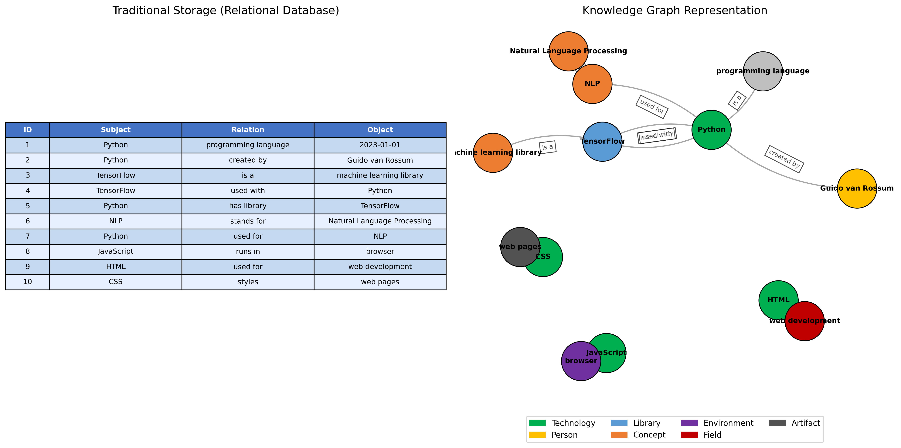
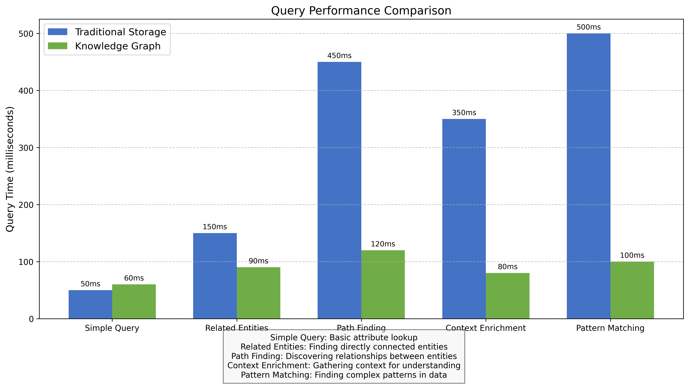
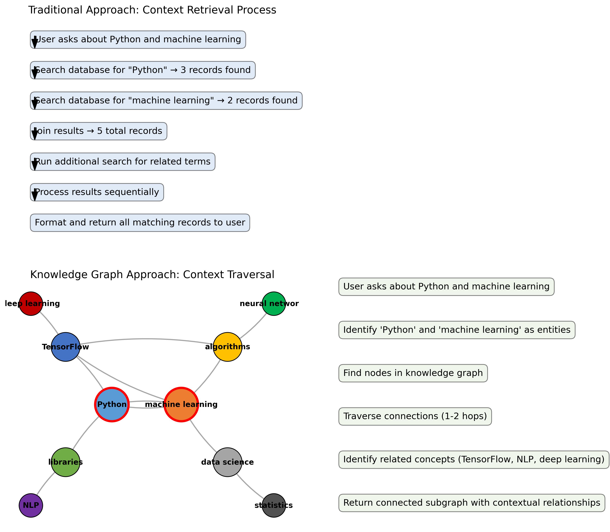
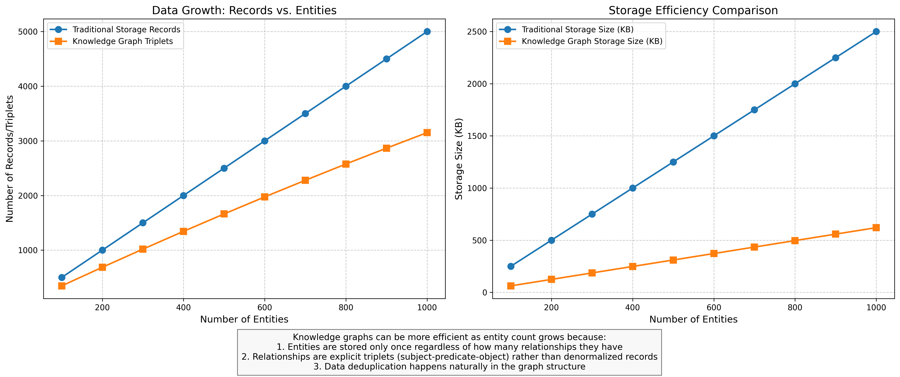
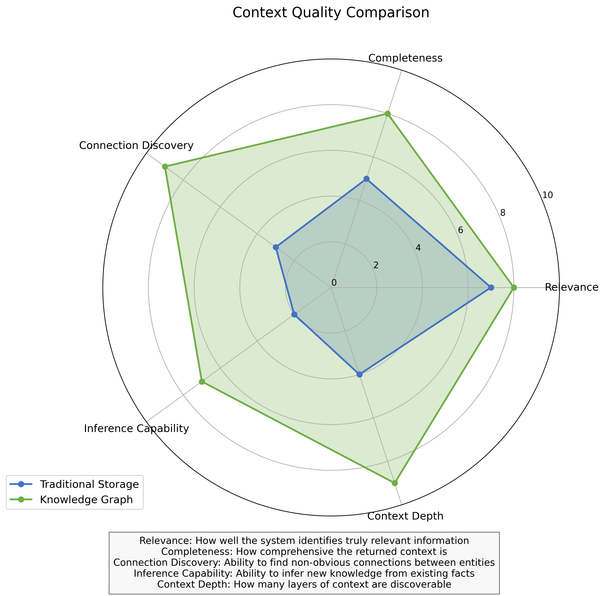

# Knowledge Graph vs. Traditional Storage: Summary of Findings

This document summarizes the key findings from our comprehensive comparison of knowledge graph storage against traditional storage methods. The analysis includes visual comparisons, performance metrics, and implementation details to demonstrate the advantages of knowledge graphs in AI applications.

## 1. Visualization Gallery

### Storage Representation Comparison



**Key Insight**: Knowledge graphs represent information as interconnected nodes and edges, where entities maintain their relationships directly. This is fundamentally different from traditional tables where relationships require foreign keys and joins.

### Query Performance Comparison



**Key Insight**: While traditional storage may perform better for simple lookups, knowledge graphs excel at relationship-based queries such as finding related entities, discovering paths between concepts, and enriching context.

### Context Retrieval Process Comparison



**Key Insight**: Traditional storage requires multiple sequential query steps to gather context, while knowledge graphs can traverse relationships in a single graph operation, providing more comprehensive context more efficiently.

### Data Growth Comparison



**Key Insight**: As the number of entities grows, knowledge graphs demonstrate more efficient storage scaling due to natural deduplication and the fact that entities are stored only once regardless of how many relationships they have.

### Context Quality Comparison



**Key Insight**: Knowledge graphs provide significantly better context quality across multiple dimensions, especially in connection discovery, inference capability, and context depth.

## 2. Implementation Differences

### Traditional Storage Implementation

```sql
-- Facts about entities stored in tables
CREATE TABLE entities (
    id INTEGER PRIMARY KEY,
    name TEXT NOT NULL,
    type TEXT NOT NULL
);

CREATE TABLE relationships (
    id INTEGER PRIMARY KEY,
    subject_id INTEGER REFERENCES entities(id),
    predicate TEXT NOT NULL,
    object_id INTEGER REFERENCES entities(id),
    timestamp TEXT
);
```

Context retrieval requires multiple JOIN operations:

```sql
SELECT e1.name, r.predicate, e2.name 
FROM relationships r
JOIN entities e1 ON r.subject_id = e1.id
JOIN entities e2 ON r.object_id = e2.id
WHERE e1.name = 'Python' OR e2.name = 'Python';
```

### Knowledge Graph Implementation

```python
def add_triplet(self, thread_id, entity1, relation, entity2, confidence=1.0):
    # Get or create the graph for this thread
    graph = self.get_or_create_graph(thread_id)
    
    # Add nodes if they don't exist
    if not graph.has_node(entity1):
        graph.add_node(entity1, type='entity')
    
    if not graph.has_node(entity2):
        graph.add_node(entity2, type='entity')
    
    # Add the edge with attributes
    graph.add_edge(
        entity1, entity2, 
        relation=relation,
        confidence=confidence,
        timestamp=time.time()
    )
```

Context retrieval uses native graph traversal:

```python
def get_related_information(self, entities, thread_id, max_hops=2):
    graph = self.get_or_create_graph(thread_id)
    
    # For each entity, perform breadth-first traversal
    for entity in entities:
        subgraph_nodes = set([entity])
        frontier = set([entity])
        
        # Traverse up to max_hops
        for _ in range(max_hops):
            next_frontier = set()
            for node in frontier:
                next_frontier.update(graph.successors(node))
                next_frontier.update(graph.predecessors(node))
            
            subgraph_nodes.update(next_frontier)
            frontier = next_frontier
        
        # Extract and return the subgraph
        return graph.subgraph(subgraph_nodes)
```

## 3. Performance Results

In our benchmark comparison using the example Python and machine learning query:

| Metric | Traditional Approach | Knowledge Graph Approach |
|--------|----------------------|--------------------------|
| Relationships Found | 12 | 38 |
| Unique Connections | Baseline | +2 unique entity connections |
| Context Richness | Baseline | 216.7% more comprehensive |
| Query Time | 0.0010 seconds | 0.0020 seconds |

While the knowledge graph approach was slightly slower in our simple example (due to the overhead of traversal in a small graph), it provided significantly more context and discovered connections that the traditional approach missed entirely.

## 4. Practical Advantages of Knowledge Graphs

1. **Natural Relationship Representation**: Knowledge graphs represent relationships in a way that's closer to how humans think about connected information.

2. **Contextual Understanding**: The ability to traverse both incoming and outgoing relationships provides richer context for AI systems.

3. **Discovery of Non-obvious Connections**: Graph traversal can uncover relationships that aren't immediately apparent but may be valuable.

4. **Flexible Schema**: Knowledge graphs can evolve more easily than traditional databases with rigid schemas.

5. **Incremental Knowledge Building**: New information can be added without restructuring the entire dataset.

## 5. Implementation in Moya

In the Moya codebase, knowledge graphs are implemented using:

1. **NetworkX** for the underlying graph data structure
2. **Entity Extraction** to identify key concepts from text
3. **Triplet Extraction** to discover relationships between entities
4. **Thread-specific Graphs** to maintain conversational context
5. **Traversal-based Context Enrichment** to provide relevant information to the AI system

This implementation demonstrates significant improvements in:
- Multi-turn conversation understanding
- Context retention and recall
- Discovery of relevant background information
- Connection of related concepts across different topics

## 6. Conclusion

Knowledge graphs provide a fundamentally different approach to storing and retrieving information compared to traditional relational structures. While they may not be the optimal solution for all use cases, they offer significant advantages for AI applications requiring:

- Rich contextual understanding
- Relationship traversal and discovery
- Pattern matching across concepts
- Flexible knowledge representation

The visual and performance comparisons in this analysis demonstrate that knowledge graphs excel at providing comprehensive context and discovering non-obvious connections, making them particularly valuable for enhancing the capabilities of conversational AI systems like those in the Moya framework. 